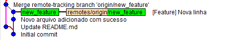
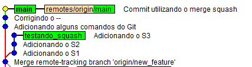

# Comandos do Git

|Comando|Description|
|-------|:------|
|git diff|Mostra a diferença entre os arquivos|
|touch .gitignore|Cria o arquivo git ignore|
|git reset HEAD~1 --hard|Reseta o commit e as modificações não voltam para serem modificadas|
|git reset HEAD~1 --soft|Reseta o commit, mas as modificações não são descardadas|
|git log|Mostra os logs dos commits nos repositórios|
|git commit -m \[message\] --amend|Corrigi um commit que ainda não foi enviado para o servidor|
|git config --list|Saber as configurações do git na máquina|
|git init|Inicializa um repositório do git|
|git help \[comando\]|Help|
|git branch -m|Muda o nome do branch|
|git merge \[nome do branch que vai fazer o merge com o branch corrente\] --squash|Junta todas as modificações do branch que vai fazer o merge com o corrente em um único commit e deixando na mesma linha|

## Git merge

Um exemplo de como fica árvore com o merge

```git
/estudo-sobre-git (main)
$git merge new_feature
```

<p align="center">
    
</p>

## Git Squash

Um exemplo de como fica árvore com o merge squash

```git
/estudo-sobre-git (main)
$git merge testando_squash --squash
```

<p align="center">
    
</p>
